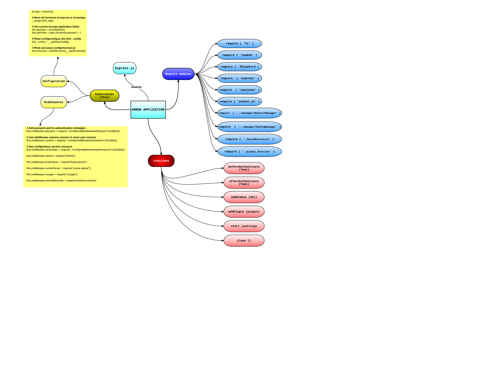

# Color Pro
Color Collection using Express + Vuejs + ElasticSearch


## Chức năng

#### 1) Tìm kiếm theo tên, mã màu, ID pallet

#### 2) Phân trang
    
    
    let q = req.body['page'];
    let n = 20;
    let pgfrom = 0;
    if (q != undefined && q > 0) {
        pgfrom = (q - 1) * n;
    } else {
        q = 1;
    }
    
- q: Trang hiện tại (Mặc định là 1)
- n: Số lượng pallet trong 1 trang
- pgfrom: Bắt đầu từ đâu trong mảng

#### 3) Sắp xếp mới nhất, nhiều like nhất

- Mới nhất

    ```
    return new Promise ( ( resolve, reject ) => {
        this.elas.search ({
            index : index,
            type : type,
            body : {
                "from"  : 0,
                "size"  : 5000,
                "sort"  : {
                     "date": {
                         "order": "desc"
                     }
                },
                "query" : {
                    "match_all" : {}
                }
            }
        } , ( err, resp, stt) => {
            if (err) {
                reject (err.message);
            } else {
                let products = [];
                resp.hits.hits.forEach ( (product) => {
                    products.push ( product['_source'] );
                });
                resolve ( products );
            }
        });
    })
    ```

- Nhiều like nhất

    ```
    return new Promise ( ( resolve, reject ) => {
        this.elas.search ({
            index : index,
            type : type,
            body : {
                "from"  : 0,
                "size"  : 5000,
                "sort"  : {
                     "like": {
                         "order": "desc"
                     }
                },
                "query" : {
                    "match_all" : {}
                }
            }
        } , ( err, resp, stt) => {
            if (err) {
                reject (err.message);
            } else {
                let products = [];
                resp.hits.hits.forEach ( (product) => {
                    products.push ( product['_source'] );
                });
                resolve ( products );
            }
        });
    })
    ```

#### 4) Đăng nhập

#### 5) Đăng ký

#### 6) Copy mã màu
    
    ```
    function copyTextToClipboard(text) {
        var textArea = document.createElement("textarea");
        
        textArea.value = text;
    
        document.body.appendChild(textArea);
    
        textArea.select();
    
        try {
            var successful = document.execCommand('copy');
            var msg = successful ? 'successful' : 'unsuccessful';
            console.log('Copying text command was ' + msg);
        } catch (err) {
            console.log('Oops, unable to copy');
        }
    
        document.body.removeChild(textArea);
    }
    ```
    
#### 7) Like / dislike

- Bước 1: Client gửi ID pallet, action (like hoặc dislike) lên Server
    
    ```
    likedislike(collection_id, action ){
        $('.box-like-dislike-share > span').addClass('disabled');
        axios.post('/likedislike', {
            collection_id: collection_id,
            action: action
        })
            .then (response => {
                if(response.data.error) {
                    alert(response.data.error)
                }else{
                    this.collection = response.data;
                }
                $('.box-like-dislike-share > span').removeClass('disabled');
            })
            .catch ( error => {
                //this.dt = [];
                $('.box-like-dislike-share > span').removeClass('disabled');
            });
    }
    ```
    
- Bước 2: Kiểm tra

    + Nếu đã like mà click vào "like" nữa thì giảm 1 like
    + Nếu đã dislike mà click vào "dislike" nữa thì giảm 1 dislike
    + Nếu đã like mà click vào "dislike" nữa thì giảm 1 like, tăng dislike thêm 1
    + Nếu đã dislike mà click vào "like" nữa thì giảm 1 dislike, tăng like thêm 1
    
    + Nếu chưa like/dislike thì tăng like/dislike thêm 1

    ```
    likedislike.clickLikeDislike(collection_id, user_id, status)
        .then(data => {
            collection.getCollection(data, user_id)
                .then((data1) => {
                    res.json(data1[0])
                });
        },
        failed => {
            res.json({error: 'Failed'});
        });
    ```
- Bước 3: Cập nhật, xóa trong elasticsearch
    
    + Thêm 1 like/dislike
    ```
    elas.insertDocument('icolor', 'like_dislike', doc)
        .then((data1) => {
            elas.updateDocument('icolor', 'collection', doc1)
            .then((data3) => {
                resolve(collection_id)
            })
        })
    ```
    
    + Cập nhật 1 like/dislike
    ```
    elas.updateDocument('icolor', 'like_dislike', data[0])
        .then((data1) => {
            elas.updateDocument('icolor', 'collection', doc1)
            .then((data3) => {
                resolve(collection_id)
            })
        })
    ```
    
    + Xóa 1 like/dislike
    ```
    elas.deleteDocument('icolor', 'like_dislike', data[0])
        .then((data1) => {
            elas.updateDocument('icolor', 'collection', doc1)
            .then((data3) => {
                resolve(collection_id)
            })
        })
    ```
    
#### 8) Hiển thị Pallet liên quan theo màu.

#### 9) Thêm Pallet

#### 10) Pick color

- Sử dụng thư viện: [jscolor](http://jscolor.com/)

#### 11) Chọn màu từ ảnh

- Bước 1: Kiểm tra input đã chọn file chưa

    ```
    onFileChange(e) {
        let files = e.target.files || e.dataTransfer.files;
        if (!files.length)
            return;

        this.createImage(files[0]);
    }
    ```
    
- Bước 2 Hiển thị image

    ```
    createImage(file) {
        let image = new Image();
        let reader = new FileReader();
        let vm = this;
        if (this.uploadimage < 1) {
            this.uploadimage = 1;
            this.pickColor();
        }

        $('.scolor').removeAttr('style');

        reader.onload = (e) => {
            vm.image = e.target.result;
        };
        reader.readAsDataURL(file);
    }
    ```

-Bước 3: Tạo image bằng canvas, Lấy màu và gán vào thẻ input

    ```
    pickColor() {
        let that = this;
        let img = _('.previewimg img'),
            canvas = _('#cs'),
            result = _('.result'),
            preview = _('.preview'), x = '', y = '';
        
        img.addEventListener('click', function (e) {
            // chrome
            if (e.offsetX) {
                x = e.offsetX;
                y = e.offsetY;
            }
            // firefox
            else if (e.layerX) {
                x = e.layerX;
                y = e.layerY;
            }
            useCanvas(canvas, img, function () {
                // get image data
                let p = canvas.getContext('2d')
                    .getImageData(x, y, 1, 1).data;
                let hexColor = rgbToHex(p[0], p[1], p[2]);
                let colorCurrent = that.inputActive;

                $('.s' + colorCurrent).attr('style', 'opacity: 1; left: ' + (x-2) + 'px; top: ' + (y-2) + 'px;');
                $('input[name="' + colorCurrent + '"]').val(hexColor);
                $('input[name="' + colorCurrent + '"]').attr('style', 'background:#' + hexColor);
            });
        }, false);

        img.addEventListener('mousemove', function (e) {
            // chrome
            if (e.offsetX) {
                x = e.offsetX;
                y = e.offsetY;
            }
            // firefox
            else if (e.layerX) {
                x = e.layerX;
                y = e.layerY;
            }

            useCanvas(canvas, img, function () {

                let p = canvas.getContext('2d')
                    .getImageData(x, y, 1, 1).data;
            });
        }, false);

        function useCanvas(el, image, callback) {
            el.width = image.width; // img width
            el.height = image.height; // img height
            el.getContext('2d')
                .drawImage(image, 0, 0, image.width, image.height);
            return callback();
        }

        function _(el) {
            return document.querySelector(el);
        };

        function componentToHex(c) {
            let hex = c.toString(16);
            return hex.length == 1 ? "0" + hex : hex;
        }

        function rgbToHex(r, g, b) {
            return componentToHex(r) + componentToHex(g) + componentToHex(b);
        }

        function findPos(obj) {
            let curleft = 0, curtop = 0;
            if (obj.offsetParent) {
                do {
                    curleft += obj.offsetLeft;
                    curtop += obj.offsetTop;
                } while (obj = obj.offsetParent);
                return {x: curleft, y: curtop};
            }
            return undefined;
        }
    }
    ```

#### 12) Clone pallet

- Bước 1: Gửi ID Pallet lên server
    ```
    getList() {
        let selectCurrent = $('#clonepallet option:selected').val();
        if(selectCurrent.trim().length > 0){
            axios.post('/clonepallet', {
                idPallet: selectCurrent,
            })
                .then(res => {

                    if(res.data.pallet[0].color1) {

                        let pcolor1 = res.data.pallet[0].color1.replace('#', '');
                        let pcolor2 = res.data.pallet[0].color2.replace('#', '');
                        let pcolor3 = res.data.pallet[0].color3.replace('#', '');
                        let pcolor4 = res.data.pallet[0].color4.replace('#', '');
                        let pcolor5 = res.data.pallet[0].color5.replace('#', '');

                        $('input[name="color1"]').val(pcolor1);
                        $('input[name="color2"]').val(pcolor2);
                        $('input[name="color3"]').val(pcolor3);
                        $('input[name="color4"]').val(pcolor4);
                        $('input[name="color5"]').val(pcolor5);

                        $('input[name="color1"]').attr('style', 'background:#' + pcolor1);
                        $('input[name="color2"]').attr('style', 'background:#' + pcolor2);
                        $('input[name="color3"]').attr('style', 'background:#' + pcolor3);
                        $('input[name="color4"]').attr('style', 'background:#' + pcolor4);
                        $('input[name="color5"]').attr('style', 'background:#' + pcolor5);
                    }

                    $('.scolor').removeAttr('style');

                    setTimeout(function(){
                        $('.msgClone').slideUp('fast');
                    }, 1000)

                })
                .catch(error => {
                    //this.related_collection = [];
                });
        }else{
            alert('Please select pallet')
        }
    }
    ```

- Bước 2: Lấy thông tin Pallet từ Elasticsearch

    ```
    collection.getCollection(idPallet, user_id)
        .then(data => {
            res.json({
                    pallet: data,
                    islogin: req.session.login,
                    users: req.session.user.email || '',
                    msgClone: 'Clone Successful'
                })
        })
        .catch(err => {
            res.json({
                    islogin: req.session.login,
                    users: req.session.user.email || '',
                    msgClone: 'Clone Fail'
                })
        });
    ```

- Bước 3: Gán giá trị vào 5 input (Color #1 -> #5)

    ```
    $('input[name="color1"]').val(pcolor1);
    $('input[name="color2"]').val(pcolor2);
    $('input[name="color3"]').val(pcolor3);
    $('input[name="color4"]').val(pcolor4);
    $('input[name="color5"]').val(pcolor5);
    ```

## Sử dụng
1) Express
2) Express-vue
3) Elasticsearch
4) JWT

## Cài elasticsearch
1) Tải elasticsearch trong docker
```
docker pull elasticsearch:5.3.1-alpine
```

2) Container
```
docker run -d -p 9200:9200 --name elas elasticsearch:5.3.1-alpine -Ediscovery.zen.minimum_master_nodes=1
```

3) Vào trong container để cài X-Pack
```
docker exec -it elas /bin/sh
```

4) Vào được container "elas" rồi Chạy lệnh:
```
bin/elasticsearch-plugin install x-pack
```

5) Chạy xong thì có thể chạy được
```
http://localhost:9200/
username: elastic
password: changeme
```

## Cài đặt dữ liệu mẫu (init.js)
1) Chạy function createIndex để tạo DATABASE
```
createIndex();
```

2) Chạy function initData để thêm Pallet mẫu
```
initData();
```

3) Chạy function addAuthor để tạo user mặc định

```
addAuthor(author);
```

4) Chạy chương trình
```
node index.js
```


## Giao diện website
- Trang chủ


- Trang chi tiết





