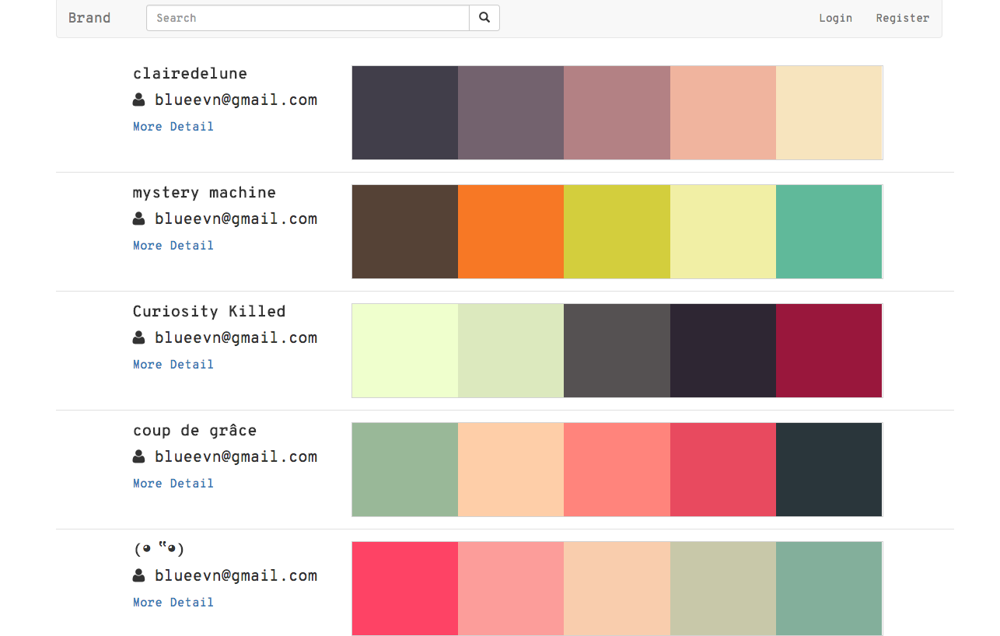
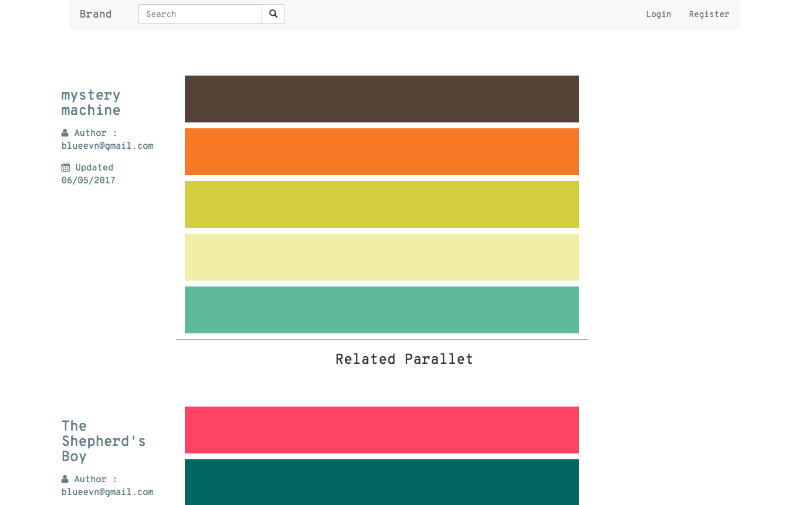

# Color-Pro
Color Collection using Express + Vuejs + ElasticSearch


## Chức năng

#### 1) Tìm kiếm theo tên, mã màu, ID pallet

#### 2) Phân trang
    
    
    let q = req.body['page'];
    let n = 20;
    let pgfrom = 0;
    if (q != undefined && q > 0) {
        pgfrom = (q - 1) * n;
    } else {
        q = 1;
    }
    
- q: Trang hiện tại (Mặc định là 1)
- n: Số lượng pallet trong 1 trang
- pgfrom: Bắt đầu từ đâu trong mảng

#### 3) Sắp xếp mới nhất, nhiều like nhất

- Mới nhất

    
    return new Promise ( ( resolve, reject ) => {
        this.elas.search ({
            index : index,
            type : type,
            body : {
                "from"  : 0,
                "size"  : 5000,
                "sort"  : {
                     "date": {
                         "order": "desc"
                     }
                },
                "query" : {
                    "match_all" : {}
                }
            }
        } , ( err, resp, stt) => {
            if (err) {
                reject (err.message);
            } else {
                let products = [];
                resp.hits.hits.forEach ( (product) => {
                    products.push ( product['_source'] );
                });
                resolve ( products );
            }
        });
    })
    

- Nhiều like nhất

    
    return new Promise ( ( resolve, reject ) => {
        this.elas.search ({
            index : index,
            type : type,
            body : {
                "from"  : 0,
                "size"  : 5000,
                "sort"  : {
                     "like": {
                         "order": "desc"
                     }
                },
                "query" : {
                    "match_all" : {}
                }
            }
        } , ( err, resp, stt) => {
            if (err) {
                reject (err.message);
            } else {
                let products = [];
                resp.hits.hits.forEach ( (product) => {
                    products.push ( product['_source'] );
                });
                resolve ( products );
            }
        });
    })
    

#### 4) Đăng nhập

#### 5) Đăng ký

#### 6) Copy mã màu
    
    
    function copyTextToClipboard(text) {
        var textArea = document.createElement("textarea");
        
        textArea.value = text;
    
        document.body.appendChild(textArea);
    
        textArea.select();
    
        try {
            var successful = document.execCommand('copy');
            var msg = successful ? 'successful' : 'unsuccessful';
            console.log('Copying text command was ' + msg);
        } catch (err) {
            console.log('Oops, unable to copy');
        }
    
        document.body.removeChild(textArea);
    }
    
    
#### 7) Like / dislike

- Bước 1: Client gửi ID pallet, action (like hoặc dislike) lên Server
    
    ```
    likedislike(collection_id, action ){
        $('.box-like-dislike-share > span').addClass('disabled');
        axios.post('/likedislike', {
            collection_id: collection_id,
            action: action
        })
            .then (response => {
                if(response.data.error) {
                    alert(response.data.error)
                }else{
                    this.collection = response.data;
                }
                $('.box-like-dislike-share > span').removeClass('disabled');
            })
            .catch ( error => {
                //this.dt = [];
                $('.box-like-dislike-share > span').removeClass('disabled');
            });
    }
    ```
    
- Bước 2: Kiểm tra

    + Nếu đã like mà click vào "like" nữa thì giảm 1 like
    + Nếu đã dislike mà click vào "dislike" nữa thì giảm 1 dislike
    + Nếu đã like mà click vào "dislike" nữa thì giảm 1 like, tăng dislike thêm 1
    + Nếu đã dislike mà click vào "like" nữa thì giảm 1 dislike, tăng like thêm 1
    
    + Nếu chưa like/dislike thì tăng like/dislike thêm 1

    ```
    likedislike.clickLikeDislike(collection_id, user_id, status){...}
    ```
- Bước 3: Cập nhật, xóa trong elasticsearch
    
    + Thêm 1 like/dislike
    ```
    elas.insertDocument('icolor', 'like_dislike', data){...}
    ```
    
    + Cập nhật 1 like/dislike
    ```
    elas.updateDocument('icolor', 'like_dislike', data){...}
    ```
    
    + Xóa 1 like/dislike
    ```
    elas.deleteDocument('icolor', 'like_dislike', data){...}
    ```
    
#### 8) Hiển thị Pallet liên quan theo màu.

#### 9) Thêm Pallet

#### 10) Pick color

#### 11) Chọn màu từ ảnh

#### 12) Clone pallet

## Sử dụng
1) Express
2) Express-vue
3) Elasticsearch
4) JWT

## Cài elasticsearch
1) Tải elasticsearch trong docker
```
docker pull elasticsearch:5.3.1-alpine
```

2) Container
```
docker run -d -p 9200:9200 --name elas elasticsearch:5.3.1-alpine -Ediscovery.zen.minimum_master_nodes=1
```

3) Vào trong container để cài X-Pack
```
docker exec -it elas /bin/sh
```

4) Vào được container "elas" rồi Chạy lệnh:
```
bin/elasticsearch-plugin install x-pack
```

5) Chạy xong thì có thể chạy được
```
http://localhost:9200/
username: elastic
password: changeme
```

## Cài đặt dữ liệu mẫu (init.js)
1) Chạy function createIndex để tạo DATABASE
```
createIndex();
```

2) Chạy function initData để thêm Pallet mẫu
```
initData();
```

3) Chạy function addAuthor để tạo user mặc định

```
addAuthor(author);
```

4) Chạy chương trình
```
node index.js
```


## Giao diện website
- Trang chủ


- Trang chi tiết



